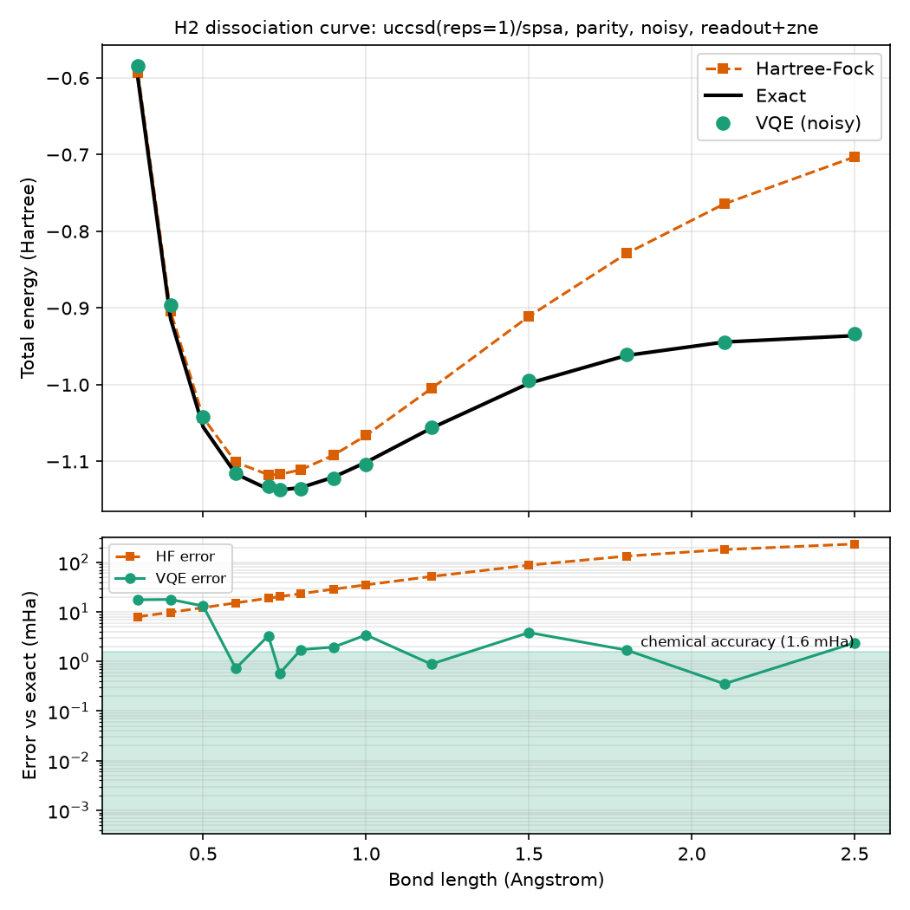
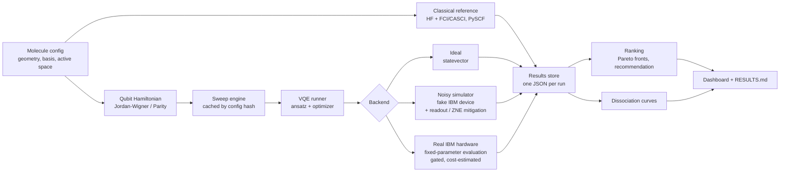
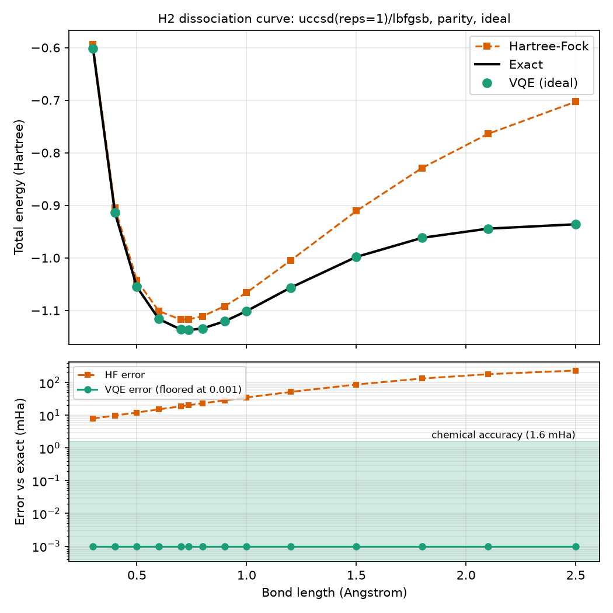

# MiraiChem

**Team Mirai · Q-Hack India 2026 · Track: Quantum Biotech & Chemistry**

MiraiChem is an automated benchmarking and recommendation pipeline that finds the most reliable
VQE configuration (ansatz, optimizer, qubit mapping, error mitigation, shots) for simulating a small
molecule on a noisy IBM quantum backend, and checks the recommendation on real IBM hardware.



*H2 potential-energy curve from the noisy simulator (UCCSD, Parity mapping, readout + ZNE
mitigation). Hartree-Fock fails as the bond stretches; mitigated VQE follows the exact curve.*

## Contents

1. [Problem](#1-problem)
2. [Our solution and what is new](#2-our-solution-and-what-is-new)
3. [Architecture](#3-architecture)
4. [Tech stack](#4-tech-stack)
5. [Setup](#5-setup)
6. [How to run](#6-how-to-run)
7. [Results](#7-results)
8. [Limitations and honest notes](#8-limitations-and-honest-notes)
9. [Roadmap](#9-roadmap)
10. [References](#10-references)
11. [Team](#11-team)

## 1. Problem

The variational quantum eigensolver (VQE) estimates a molecule's ground-state energy by tuning a
parameterised quantum circuit. On today's noisy devices the answer depends heavily on choices that
are usually made by trial and error:

- **ansatz** (the circuit shape: chemistry-inspired UCCSD or shallow hardware-efficient),
- **fermion-to-qubit mapping** (Jordan-Wigner or Parity, which differ in qubit count and depth),
- **classical optimizer** (COBYLA, SPSA, L-BFGS-B),
- **error mitigation** (readout correction, zero-noise extrapolation) and the **shot budget**.

A setup that works on an ideal simulator often fails on real hardware, and scarce hardware time is
wasted finding that out. Our own results show the size of the effect. One H2 configuration (UCCSD,
Parity mapping) has an error of 0.4 mHa on an ideal simulator, 84.5 mHa on a real IBM device without
mitigation, and 3.0 mHa on the same device with readout + zero-noise-extrapolation mitigation
(chemical accuracy is 1.6 mHa).

## 2. Our solution and what is new

MiraiChem takes a molecule and does the following:

1. Computes classical reference energies (Hartree-Fock and exact FCI/CASCI) with PySCF.
2. Builds the qubit Hamiltonian under one or more mappings.
3. **Sweeps** many VQE configurations on an ideal simulator and on a noisy simulator that uses the
   noise model and connectivity of a real IBM device (fake backend).
4. Records metrics for every run: error vs exact, transpiled depth, two-qubit gates, shots, time.
5. **Ranks** the runs, computes Pareto fronts (accuracy vs cost), and **recommends** a configuration
   with a justification built from the real numbers.
6. Scans the recommended configurations over bond lengths (dissociation curves).
7. **Validates on real IBM hardware** by evaluating the best simulator parameters on a device with
   and without mitigation.
8. Shows everything in a dashboard that reads only saved results.

**What is new is the engineering, not the chemistry.** We do not claim a new chemistry method or a
quantum advantage (H2 and LiH are trivial for classical computers). The contribution is a
reproducible, configurable, cost-aware benchmark with these distinguishing features:

- **Whole-curve recommendation.** A configuration that is chemically accurate at equilibrium can
  fail when the bond is stretched. In our data a shallow ansatz was the cheapest accurate choice at
  equilibrium but only 79% accurate over the curve (worst error 44 mHa). The recommender therefore
  judges configurations by worst-case error and coverage across a scan.
- **Mitigation measured per evaluation.** Mitigated and unmitigated energies are stored together,
  so "before vs after" is a plot, on the simulator and on hardware.
- **Hardware-aware simulation.** The noisy backend runs a real shot-based measurement pipeline
  (grouped Pauli measurements, readout errors, gate errors), which is what makes readout
  mitigation and gate-folding ZNE meaningful.
- **Simulator checked against hardware.** The recommended configurations were evaluated on a real
  IBM device, so the simulator's predictions are tested instead of assumed.
- **Reproducibility.** Every run has a config hash, a seed, library versions and the git commit,
  and finished runs are cached, so sweeps can be stopped and resumed.

## 3. Architecture



| Module | What it does |
|---|---|
| `config.py` | Pydantic models for molecules, runs and sweeps; stable config hashing; invalid-combination rules |
| `chemistry/` | PySCF molecules, active-space selection, HF and FCI/CASCI reference energies |
| `mapping/` | Fermion-to-qubit mapping (Jordan-Wigner, Parity), qubit Hamiltonian, exact-energy check |
| `ansatz/` | UCCSD and hardware-efficient ansatz, both starting from the Hartree-Fock state |
| `optim/` | COBYLA, SPSA (seeded) and L-BFGS-B behind one interface; budgets counted in evaluations |
| `backends/` | Ideal statevector, noisy Aer simulator with a fake IBM device, gated real-hardware backend |
| `mitigation/` | Readout (measurement) mitigation and gate-folding zero-noise extrapolation |
| `vqe/` | The VQE loop, per-run failure capture and the saved `RunResult` record |
| `benchmark/` | Sweep engine, metrics, ranking, scan ranking, storage, report generation |
| `analysis/` | Dissociation curves (matplotlib and plotly) |
| `cli.py`, `dashboard/` | Command-line interface and Streamlit dashboard |

Design decisions and alternatives we rejected are recorded in
[docs/DECISIONS.md](docs/DECISIONS.md). A generated summary of every result is in
[docs/RESULTS.md](docs/RESULTS.md).

## 4. Tech stack

Python 3.11. Versions are pinned in [requirements.txt](requirements.txt).

| Purpose | Package |
|---|---|
| Quantum circuits and primitives | `qiskit` 2.5.2, `qiskit-aer` 0.17.2, `qiskit-ibm-runtime` 0.50.0 |
| Chemistry to qubits | `qiskit-nature` 0.8.0, `qiskit-algorithms` 0.4.0, `pyscf` 2.14.0 |
| Numerics and data | `numpy` 2.2.6, `scipy` 1.17.1, `pandas` 2.3.3, `pyarrow` 25.0.1 |
| Configuration and CLI | `pydantic` 2.13.5, `pyyaml` 6.0.3, `typer` 0.27.2, `rich` 15.0.0, `python-dotenv` 1.2.4 |
| Plots and dashboard | `matplotlib` 3.11.2, `plotly` 7.1.0, `streamlit` 1.64.0 |
| Development | `pytest` 9.1.1, `ruff` 0.16.10, `mypy` 2.4.0 |

## 5. Setup

**Prerequisites:** Python 3.11, git, and a Linux or macOS shell.

> **Windows:** PySCF does not publish Windows wheels, so use **WSL2** (Ubuntu) and run everything
> below inside it. See [docs/DECISIONS.md](docs/DECISIONS.md).

```bash
# 1. clone
git clone https://github.com/S-tevens/miraichem.git
cd miraichem

# 2. create an environment and install (uv shown; plain pip also works)
curl -LsSf https://astral.sh/uv/install.sh | sh        # skip if uv is installed
uv venv --python 3.11 .venv
source .venv/bin/activate
uv pip install -r requirements.txt
uv pip install -e . --no-deps

# alternative without uv:
#   python3.11 -m venv .venv && source .venv/bin/activate
#   pip install -r requirements.txt && pip install -e . --no-deps
```

**IBM Quantum token (optional, only needed for real hardware).** Everything else works offline.

```bash
cp .env.example .env
# edit .env and fill in IBM_QUANTUM_TOKEN and IBM_QUANTUM_INSTANCE
```

`.env` is gitignored; never commit a token.

**Check the install** (about 3 minutes, no hardware, no network):

```bash
pytest -q
```

## 6. How to run

All commands run from the repository root.

### Quick demo (about 1 minute)

```bash
# 16 H2 runs on ideal and noisy simulators (about 40 s with 4 workers)
miraichem sweep configs/sweeps/quick_h2.yaml --max-workers 4

# leaderboard, Pareto marks and a recommendation built from the real numbers
miraichem rank --molecule h2 --backend noisy
miraichem rank --molecule h2 --backend ideal

# the dashboard (open http://localhost:8501)
streamlit run dashboard/app.py
```

Results are saved to `results/<molecule>/<hash>.json`. Re-running a sweep skips finished runs
(`--force` repeats them).

### More commands

```bash
# one run, and classical reference energies
miraichem run --molecule configs/molecules/h2.yaml --ansatz uccsd --optimizer lbfgsb --backend ideal
miraichem reference --molecule configs/molecules/h2.yaml --bond-length 0.735

# full sweeps
miraichem sweep configs/sweeps/full_h2.yaml --max-workers 4            # 114 runs, about 7 min
miraichem sweep configs/sweeps/full_lih.yaml --max-workers 4           # 22 runs, about 6.5 min
miraichem sweep configs/sweeps/lih_noisy_extended.yaml --max-workers 4 # 40 runs, about 21 min

# rank across a bond-length scan (judges configurations by worst case, not one geometry)
miraichem curve --molecule configs/molecules/h2.yaml --backend ideal --max-workers 4
miraichem rank --molecule h2 --backend ideal --scan

# dissociation curve of a specific saved run, and the written report
miraichem curve --molecule configs/molecules/h2.yaml --config-hash <hash>
miraichem report            # writes docs/RESULTS.md and results/summary/summary.{csv,parquet}
```

### Real IBM hardware (optional, uses real QPU time)

Hardware is **off by default** and gated. We evaluate the optimal parameters found on the noisy
simulator on a device, instead of running a whole optimisation there, to save scarce QPU time.

```bash
# dry run: prints the cost estimate and submits nothing
miraichem hardware --molecule configs/molecules/h2.yaml --config-hash <hash> --shots 4096

# real submission: requires the flag, shows the estimate, then asks y/N
miraichem hardware --molecule configs/molecules/h2.yaml --config-hash <hash> --shots 4096 \
    --modes "none,readout,zne,readout+zne" --allow-hardware

# re-fetch a finished job by ID (uses no QPU time)
miraichem hardware-fetch <job_id>
```

Job IDs are written to `results/hardware/jobs/` the moment a job is submitted.

## 7. Results

All numbers below were produced by code in this repository and are saved under `results/`;
[docs/RESULTS.md](docs/RESULTS.md) is generated from them by `miraichem report`. Errors are measured
against the exact energy (FCI for H2, CASCI in the chosen active space for LiH). Chemical accuracy is
an error below **1.6 mHa**. **Simulator and hardware results are labelled separately.**

### H2 on the ideal simulator (simulator)

| Configuration | Within 1.6 mHa over 14 bond lengths (0.3 to 2.5 A) | Worst error |
|---|---|---|
| UCCSD / L-BFGS-B / Parity | **14 of 14** | about 0 mHa |
| HEA (reps 1) / COBYLA / Parity | 11 of 14 (79%) | 44.3 mHa |

Hartree-Fock alone is off by 20.3 mHa at equilibrium and 233 mHa at 2.5 A.



### H2 on the noisy simulator: effect of mitigation (simulator, 0.735 A)

Best error in mHa over the runs of each group (single seed per configuration, 1024 or 4096 shots):

| Mapping / ansatz | none | readout | zne | readout + zne |
|---|---|---|---|---|
| Parity / UCCSD | 43.3 | 13.1 | 35.0 | **0.577** |
| Parity / HEA | 25.4 | **1.59** | 39.0 | 3.82 |
| Jordan-Wigner / UCCSD | 257 | 226 | 131 | 97.4 |

The mapping matters most: Parity circuits need 2 qubits and 1 to 4 two-qubit gates, while
Jordan-Wigner UCCSD needs 4 qubits and 49 two-qubit gates. Across a full bond-length scan, no noisy configuration stayed chemically accurate
everywhere. The best covered 29% of the bond lengths, with a worst-case error of 17.8 mHa.

### H2 on real IBM hardware (REAL DEVICE: ibm_fez, 4096 shots, 0.735 A)

Optimal parameters from the simulator, evaluated once per mitigation mode on the device (error vs
exact in mHa, with the statistical standard error of that single run):

| Mitigation | UCCSD (Parity) | HEA, 2 reps (Parity) |
|---|---|---|
| none | 84.5 ± 5.1 | 76.2 ± 4.9 |
| readout | 25.7 ± 6.0 | 12.4 ± 5.2 |
| zne | 73.6 ± 7.5 | 73.5 ± 11.0 |
| readout + zne | **3.0 ± 12.2** | **5.2 ± 6.5** |
| *simulator prediction (for comparison)* | *0.58* | *1.59* |

Mitigation reduced the hardware error by roughly 15 to 28 times. On this device readout error
dominates: ZNE alone barely helps, and only helps once readout is corrected. The best hardware
results are within a few standard errors of chemical accuracy but cannot be distinguished from it,
or from each other, with one run each.

### LiH (2 electrons in 3 orbitals, 1.595 A)

- **Ideal simulator:** UCCSD reaches chemical accuracy (0.00 mHa) with every optimizer and both
  mappings; the hardware-efficient ansatz never does (best 19.1 mHa).
- **Noisy simulator:** nothing reaches chemical accuracy. The closest is a shallow HEA with SPSA at
  36.6 mHa; UCCSD needs 203 two-qubit gates and stays 340 to 517 mHa off.
- COBYLA stalls on noisy objectives (about 900 mHa for HEA) whereas SPSA with the same circuit reaches
  37 to 71 mHa: the optimizer, not the noise, caused that failure.

## 8. Limitations and honest notes

- **Small molecules only.** H2 (4 qubits, 2 with Parity) and LiH (a 2-electron, 3-orbital active space)
  in the STO-3G basis. These benchmark the method; classical computers solve them exactly.
  No quantum advantage is claimed.
- **One seed per configuration.** Runs with shot noise vary, so differences of a few mHa between
  configurations are not statistically resolved. Repeating the top configurations over several seeds
  would settle the rankings.
- **Mixed sweep settings.** Runs from different sweeps (different iteration and shot budgets) are
  ranked together, so rankings partly reflect those budgets.
- **The simulator is not hardware.** It uses a snapshot of a fake IBM device's noise model, which
  omits drift, crosstalk and leakage. The simulator was optimistic against the real device
  (predicted 0.6 and 1.6 mHa; measured 3.0 and 5.2 mHa).
- **Hardware budget.** The free plan allows 600 s of QPU time per period, so hardware results are
  fixed-parameter evaluations on one device at one point in time.
- **The hardware-efficient ansatz** starts from the Hartree-Fock state followed by CNOTs, which moves it
  away from the Hartree-Fock state; this contributes to its weaker ideal-backend results.
- **LiH energies** are compared with CASCI in the same active space, not full FCI.
- **Platform.** Linux, macOS or WSL2; native Windows is not supported (PySCF).

## 9. Roadmap

- Larger molecules (BeH2, H2O) with reduced active spaces, and qubit tapering (Z2 symmetry).
- More mitigation: dynamical decoupling, Pauli twirling, probabilistic error amplification.
- Multi-seed replication and confidence intervals on every ranking.
- A learned recommender that predicts a good configuration for a new molecule from past benchmark data.
- Comparison across several real backends; exportable PDF/HTML reports.

## 10. References

1. A. Peruzzo et al., "A variational eigenvalue solver on a photonic quantum processor", *Nature
   Communications* 5, 4213 (2014).
2. A. Kandala et al., "Hardware-efficient variational quantum eigensolver for small molecules and
   quantum magnets", *Nature* 549, 242 (2017).
3. K. Temme, S. Bravyi, J. M. Gambetta, "Error mitigation for short-depth quantum circuits",
   *Physical Review Letters* 119, 180509 (2017).
4. J. R. McClean et al., "Barren plateaus in quantum neural network training landscapes",
   *Nature Communications* 9, 4812 (2018).
5. Qiskit, Qiskit Aer, Qiskit IBM Runtime and Qiskit Nature: https://qiskit.org and
   https://qiskit-community.github.io/qiskit-nature
6. Q. Sun et al., "PySCF: the Python-based simulations of chemistry framework", *WIREs Computational
   Molecular Science* 8, e1340 (2018); and "Recent developments in the PySCF program package",
   *J. Chem. Phys.* 153, 024109 (2020).
7. J. R. McClean et al., "OpenFermion: the electronic structure package for quantum computers",
   *Quantum Science and Technology* 5, 034014 (2020) (used as the fallback evaluated in
   [docs/DECISIONS.md](docs/DECISIONS.md)).

## 11. Team

**Team Mirai**, Q-Hack India 2026 (Quantum Biotech & Chemistry track). Areas of focus, from
[docs/TEAM_TASKS.md](docs/TEAM_TASKS.md):

| Member | GitHub | Area |
|---|---|---|
| Stevens | [@S-tevens](https://github.com/S-tevens) | Chemistry and Hamiltonian, ranking, dissociation curves, dashboard |
| Jeeva | [@jeev-69](https://github.com/jeev-69) | Ansatz, optimizers, LiH verification |
| Ritesh | [@ritesh9116](https://github.com/ritesh9116) | Noisy backend, mitigation, real-hardware runs |
| Rohith | [@rohithrajha](https://github.com/rohithrajha) | Sweep engine, CLI, report, documentation |
