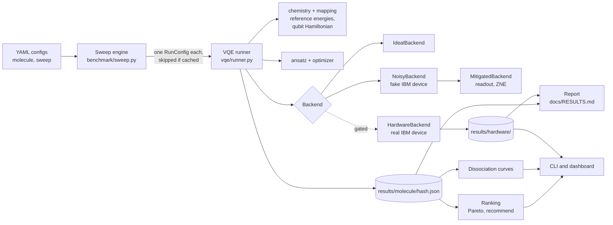
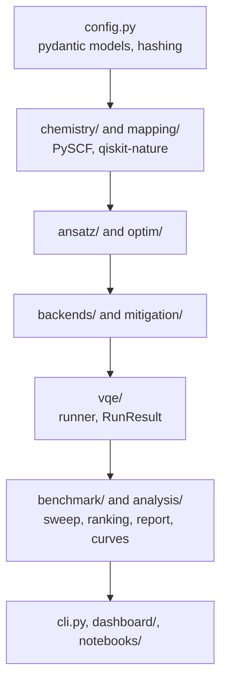
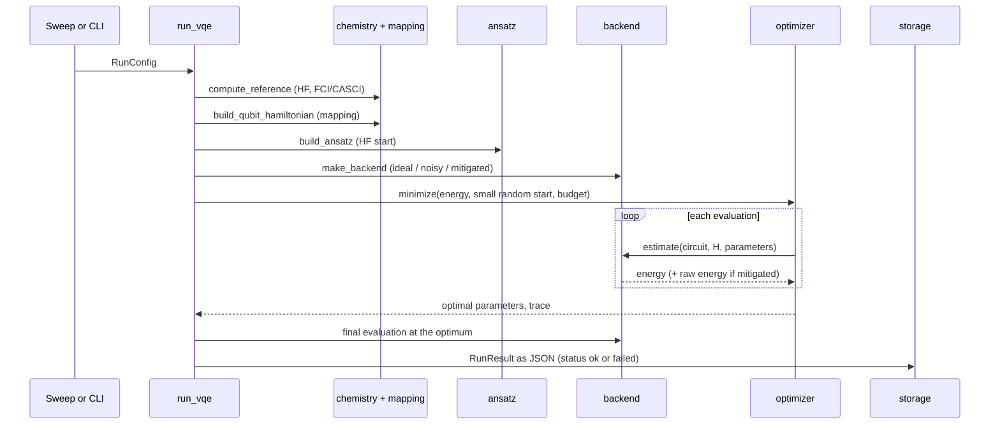
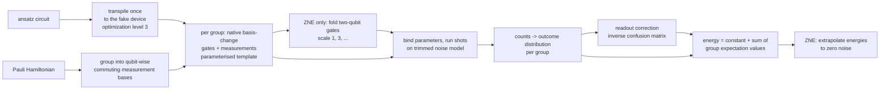
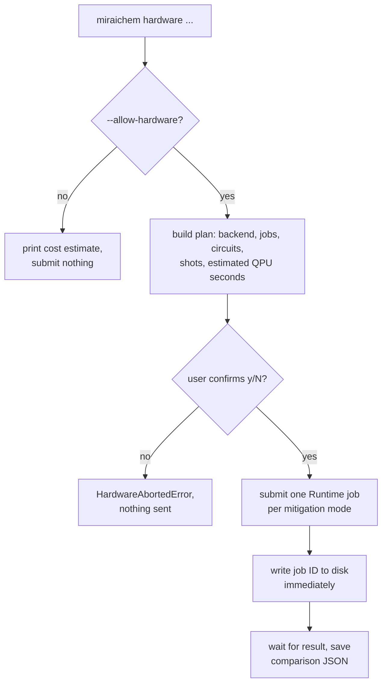

# Architecture

MiraiChem is a pipeline that turns a molecule description into a ranked, cost-aware recommendation of
how to run VQE on a noisy IBM quantum backend. This document explains how the code is organised, how
data flows through it, and where to extend it. For the why behind individual choices see
[DECISIONS.md](DECISIONS.md); for the generated numbers see [RESULTS.md](RESULTS.md).

## 1. The big picture



Everything is driven by **configs** and **saved results**. A run is fully described by a `RunConfig`; its
outcome is one JSON file named by the config's hash. Ranking, curves, the report and the dashboard only read
those files, which is why the dashboard works offline and a sweep can be stopped and resumed.

## 2. Layers

The package (`src/miraichem/`) is layered: a layer imports from the layers above it in this list. There is one
deliberate exception: the small pure helpers `benchmark/metrics.py` (error and chemical-accuracy functions)
and `benchmark/storage.py` (load and save) are also used by `vqe/` and `backends/hardware_eval.py`.



| Layer | Modules | Responsibility |
|---|---|---|
| Configuration | `config.py` | `MoleculeConfig`, `RunConfig`, `SweepConfig`; validation; the 12-character config hash; rules for invalid combinations (for example L-BFGS-B only on the ideal backend) |
| Chemistry | `chemistry/molecule.py`, `active_space.py`, `classical.py` | PySCF molecule, active-space indices, HF and FCI/CASCI reference energies (`ClassicalReference`, total energies in Hartree) |
| Mapping | `mapping/mappers.py`, `hamiltonian.py` | Jordan-Wigner or Parity mapper; `build_qubit_hamiltonian` returns a `QubitProblem` (Pauli operator, constant `energy_shift`, qubit and particle counts, the mapper); `exact_ground_energy` as a correctness check |
| Ansatz | `ansatz/uccsd.py`, `hardware_efficient.py` | UCCSD and hardware-efficient circuits, both starting from the Hartree-Fock state; `build_ansatz` returns the circuit plus parameter count and logical depth |
| Optimizers | `optim/optimizers.py` | COBYLA, SPSA (own seeded implementation) and L-BFGS-B behind one `minimize` function; `maxiter` is a budget of energy **evaluations** for all three, so comparisons are fair; every evaluation is recorded |
| Backends | `backends/base.py`, `ideal.py`, `noisy.py`, `hardware.py`, `hardware_eval.py` | Anything that can estimate `<psi(theta)|H|psi(theta)>` (the `EnergyBackend` protocol); see section 4 |
| Mitigation | `mitigation/readout.py`, `zne.py`, `mitigated.py` | Readout correction, gate-folding ZNE, and a wrapper that returns mitigated and raw energies together |
| VQE | `vqe/runner.py`, `result.py` | `run_vqe` runs one configuration and never raises; `RunResult` is the saved record |
| Benchmark | `benchmark/sweep.py`, `storage.py`, `metrics.py`, `ranking.py`, `ranking_scan.py`, `report.py` | Sweep engine and cache, result storage, metrics, ranking, scan ranking, report generation |
| Analysis | `analysis/dissociation.py`, `plots.py` | Bond-length scans and figures (matplotlib for documents, plotly for the dashboard) |
| Interfaces | `cli.py`, `dashboard/app.py`, `dashboard_helpers.py`, `notebooks/` | Command line, Streamlit dashboard, demo notebook |

## 3. What happens in one run



Key points:

- **Total energy.** The qubit Hamiltonian holds only the electronic part. The runner adds the constant
  `energy_shift` (nuclear repulsion plus any frozen-core energy) so every reported energy is a *total*
  energy, directly comparable to the PySCF reference.
- **Fair budgets.** `maxiter` counts energy evaluations, not optimiser iterations (SPSA uses 2 per step).
- **Failure isolation.** `run_vqe` catches any exception and returns a `RunResult` with `status="failed"`
  and the error message. A failed run is saved, never cached as a success, and retried on the next sweep.
- **Provenance.** Each result records the config, seed, library versions and git commit.

## 4. Backends

All backends implement the same small protocol (`backends/base.py`): `estimate(circuit, observable,
parameter_values) -> EstimateResult(value, std_error, metadata)`, plus `info()` and `total_shots`.

| Backend | Used for | How it works |
|---|---|---|
| `IdealBackend` | Upper bound, fast development | Exact statevector expectation values |
| `NoisyBackend` | Predicting real-device behaviour | Aer simulator built from a fake IBM device (noise model, gate set, coupling map); samples real shots |
| `MitigatedBackend` | Readout and ZNE mitigation | Wraps `NoisyBackend`; returns the mitigated value and the raw value |
| `HardwareBackend` | Real IBM devices | Qiskit Runtime `EstimatorV2`; heavily gated, see below |

### 4.1 The noisy measurement pipeline

We run the measurements ourselves because mitigation needs raw counts and control over the circuits.



- **Transpile once**, bind parameters per evaluation. Transpiled depth and two-qubit gate counts are what
  get reported (not the logical circuit's).
- **Noise-model trimming.** Aer reprocesses the whole noise model on every call, so a 127-qubit device is
  about 8 times slower than needed for a 4-qubit circuit. `_trim_noise_model` keeps only the errors on the
  qubits the circuit uses; a test shows the counts are identical to the full model.
- **Determinism.** Each evaluation gets a seed derived from the run seed, so a run is reproducible.
- **Mitigation.** Readout: two calibration circuits give per-qubit confusion matrices that are inverted on
  each group's outcome distribution. ZNE: every two-qubit gate is repeated (G, then G G G, ...), the energy
  is measured at each noise scale, and a linear (or Richardson) fit gives the zero-noise value.

### 4.2 The hardware safety gates

Hardware time is scarce (the free plan allows 600 s of QPU time per period), so the hardware path is
defensive by design:



- **Fixed-parameter evaluation.** We take the optimal parameters found on the noisy simulator and evaluate
  the energy on the device once per mitigation setting, instead of running the optimisation there. It costs
  a few short jobs instead of hundreds and directly tests whether the simulator predicts the device.
- **Job IDs on disk** the moment a job is submitted, so results can be re-fetched (`hardware-fetch`) if the
  session dies. Fetching uses no QPU time.
- **One combined confirmation** covers all jobs of a run; declining raises before any estimator is built.
- **Secrets** come from `.env` (never committed); the dry run works without a token.
- **Tests never submit.** Hardware tests use a fake service and estimator.

## 5. Data model and storage

```
results/
├── <molecule>/<config_hash>.json     one RunResult per run
├── curves/<molecule>_<hash>.json     one DissociationCurve per scanned configuration
├── hardware/
│   ├── <molecule>/<hash>_hw.json     one HardwareResult per hardware comparison
│   └── jobs/<job_id>.json            written at submission time
├── summary/summary.{csv,parquet}     flat table of all runs (miraichem report)
└── published/                        committed copy of the above, read by default in the dashboard
```

- **`RunConfig.config_hash()`** = first 12 hex characters of SHA-256 over the sorted-key JSON of the config.
  Same config, same hash; any change (bond length, seed, mitigation, ...) gives a different hash. The hash
  names the result file and drives caching.
- **`RunResult`** (pydantic, `vqe/result.py`) holds the config, status, energies, error in mHa,
  chemical-accuracy flag, qubit and parameter counts, logical and transpiled depth, two-qubit gates, evaluation
  and shot counts, wall time, the convergence trace (with the unmitigated trace when mitigation is on), optimal
  parameters, backend info, library versions, git commit and timestamp.
- **`results/` is gitignored** except `results/published/`, so a fresh clone can inspect the numbers behind the
  README without recomputing anything.

## 6. Benchmark, ranking and recommendation

- **Sweep engine** (`benchmark/sweep.py`): `SweepConfig.expand()` builds the Cartesian product and drops
  invalid combinations and user-excluded ones; ideal runs keep a single shot setting. `run_sweep` skips
  results already saved successfully (unless `--force`), runs the rest in-process or in a `spawn` process pool,
  and never lets one failure stop the others.
- **Ranking** (`benchmark/ranking.py`): a weighted score (accuracy 0.7, two-qubit gates 0.2, shots 0.1 by
  default; error on a log scale; each term min-max normalised), plus Pareto fronts for error vs shots and error
  vs gates. `recommend()` returns the cheapest run that reaches chemical accuracy, or the best-scoring run if
  none does, with a justification built from the run's real numbers.
- **Scan ranking** (`benchmark/ranking_scan.py`): groups runs by configuration across bond lengths and judges
  them on worst-case error and coverage (share of bond lengths within chemical accuracy), because a
  configuration that is accurate at equilibrium can fail when the bond is stretched.
- **Report** (`benchmark/report.py`): `miraichem report` writes `docs/RESULTS.md` from saved files only, with
  simulator and hardware results in separate sections.

## 7. Interfaces

| Interface | Entry point | Notes |
|---|---|---|
| CLI | `miraichem` (`cli.py`, Typer) | `reference`, `run`, `sweep`, `rank`, `curve`, `report`, `hardware`, `hardware-fetch` |
| Dashboard | `streamlit run dashboard/app.py` | Seven tabs; reads only saved results; published results by default; all data and figure logic lives in `dashboard_helpers.py` so it is unit-tested |
| Notebook | `notebooks/01_h2_end_to_end_demo.ipynb` | Only calls the package; saved with outputs |

## 8. Testing

About 125 tests run in a few minutes (`pytest -q`); they do not need a network or hardware.

| Area | What is checked |
|---|---|
| Correctness anchors | HF and FCI energies for H2 against known values; qubit Hamiltonian plus shift equals PySCF within 1e-6 Ha for H2 and LiH under both mappings; qubit counts; HF circuit energy equals PySCF HF; ideal UCCSD reaches chemical accuracy |
| Determinism | Same config and seed give the same noisy result; SPSA seeding; config hashing |
| Noise and mitigation | The noiseless pipeline equals the exact statevector (X, Y and Z bases); readout correction removes a readout-only noise model; ZNE moves a device-noise energy toward the ideal value; folding preserves the circuit's unitary; trimming the noise model changes nothing |
| Benchmark logic | Sweep caching, `--force`, failure isolation, parallel equals serial; ranking, Pareto and recommendation on synthetic data, including the equilibrium-vs-scan case |
| Safety | Hardware disabled without the flag; declined confirmation submits nothing; job IDs recorded; options valid |
| Interfaces | The real dashboard run headlessly against synthetic data; report and export; the notebook is clean (an opt-in test executes it end to end: `pytest -m notebook`) |

Linting (`ruff`) and types (`mypy`, lenient) run clean on `src/`.

## 9. How to extend it

| To add... | Do this |
|---|---|
| A molecule | Add `configs/molecules/<name>.yaml` (geometry template with `{bond_length}`, basis, active space). Check the exact-energy test for it |
| An ansatz | Add a builder in `ansatz/` returning a `QuantumCircuit` that starts from the HF state, register it in `build_ansatz`, and add the name to `AnsatzKind` in `config.py` |
| An optimizer | Add a branch in `optim/optimizers.py::minimize` that respects the evaluation budget and records every evaluation; add the name to `OptimizerKind` |
| A backend | Implement the `EnergyBackend` protocol and return it from `vqe/runner.py::make_backend` |
| A mitigation method | Extend `MitigatedBackend` (or wrap it) so it returns the mitigated value and the raw value in `metadata['unmitigated']` |
| A ranking criterion | Add a term to `Weights` and `rank_results` (and `ranking_scan.py` for scans) with a unit test on synthetic data |

## 10. Known limitations of the design

- The tensored readout model ignores correlated measurement errors; the noisy simulator ignores drift,
  crosstalk and leakage.
- ZNE folds only two-qubit gates, so a "scale factor" is a multiple of two-qubit-gate noise.
- Variances under mitigation come from the raw distributions (an approximation).
- Parallel runs use processes, so very large sweeps are limited by memory and cores, not by the code.
- The hardware path evaluates fixed parameters; it does not optimise on the device.
