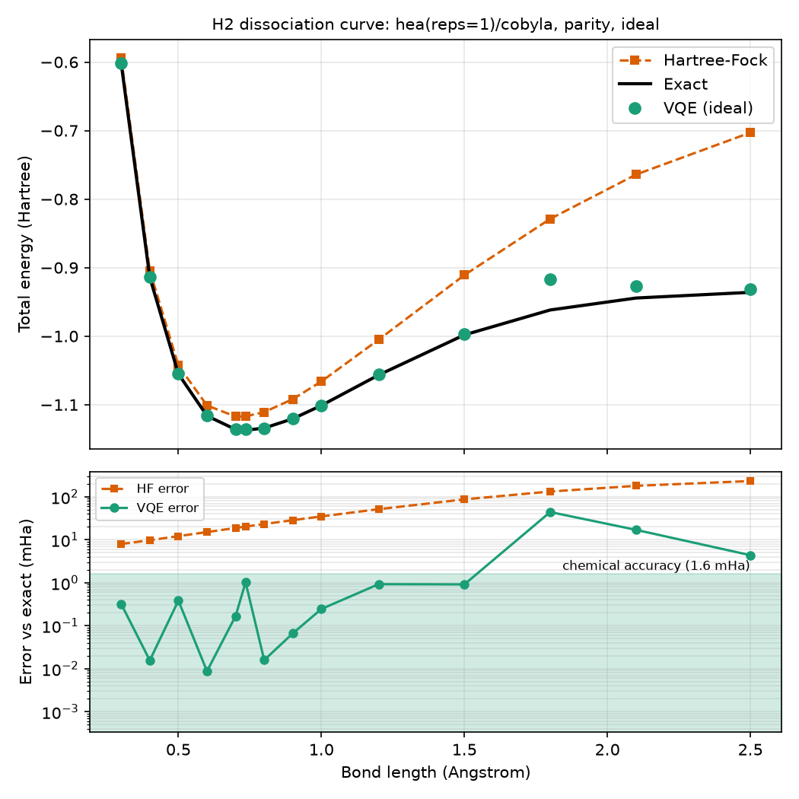
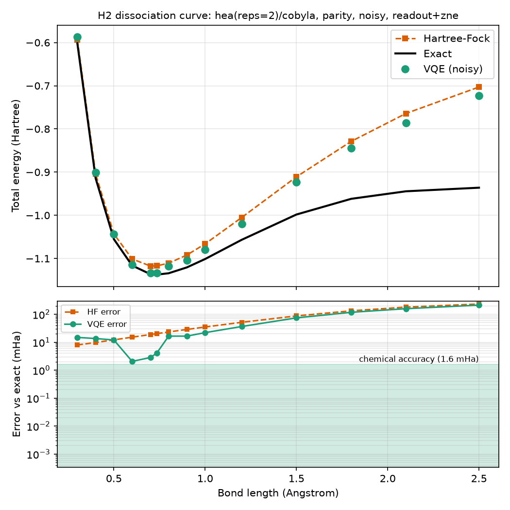
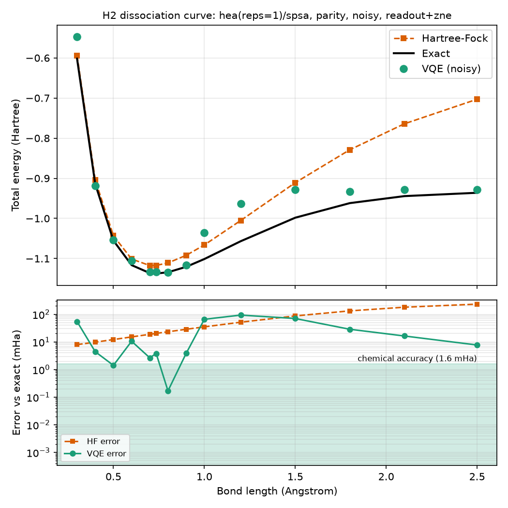
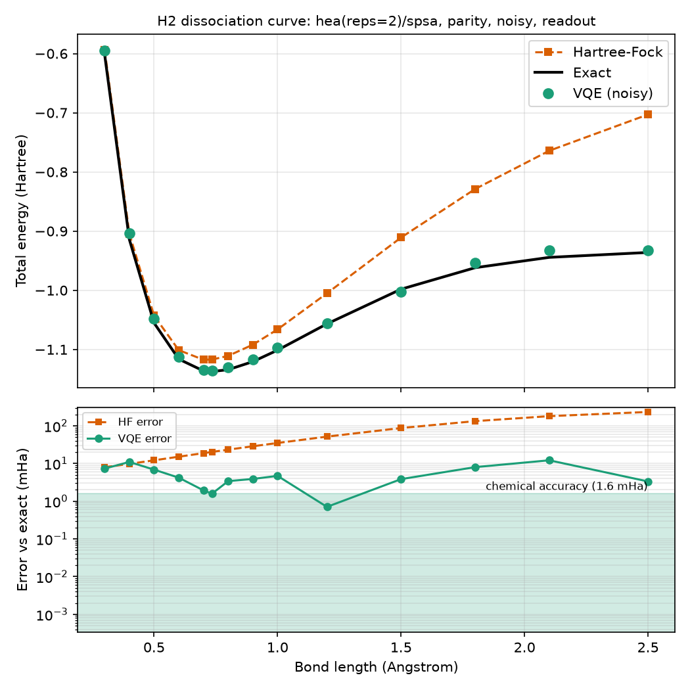

# Results

This report was generated by `miraichem report` on 2026-10-03 from **267** saved runs (267 succeeded, 0 failed).

- Energies are **total energies in Hartree**; errors are measured against the exact energy (FCI for the full space, CASCI inside an active space) and shown in milli-Hartree (mHa). *Chemical accuracy* means an error below 1.6 mHa.
- Simulator results (ideal and noisy) are kept separate from real-hardware results.

| Molecule | Backend | Successful runs |
|---|---|---|
| H2 | ideal | 56 |
| H2 | noisy | 153 |
| LiH | ideal | 18 |
| LiH | noisy | 40 |

Library versions: qiskit 2.5.2, qiskit-aer 0.17.2, qiskit-ibm-runtime 0.50.0, qiskit-nature 0.8.0, pyscf 2.14.0, numpy 2.2.6, scipy 1.17.1.
Runs were produced at git commit(s): 05177fd, 2b542a9, 46e9225, 4d967a7, ba7e130, f75d9d3.

## Simulator results

### H2: ideal statevector simulator

**Recommendation across a bond-length scan** (2 configurations; the more reliable of the two recommendations, because a configuration that is accurate near equilibrium can fail when the bond is stretched):

Recommended for H2 on the ideal backend across a scan of 14 bond lengths (0.3 to 2.5 A): uccsd(reps=1)/lbfgsb, parity. Its worst-case error is 0.001 mHa (mean 0.001 mHa), it is within chemical accuracy (1.6 mHa) at 100% of the bond lengths, and it uses on average 18 logical depth and 0 shots per point. It is the only one of 2 scanned configurations that stays chemically accurate at every bond length. For contrast, hea(reps=1)/cobyla, parity is within chemical accuracy at 79% of the bond lengths with a worst-case error of 44.3 mHa.

| # | Configuration | Points | Worst (mHa) | Mean (mHa) | Coverage |
|---|---|---|---|---|---|
| 1 | uccsd(reps=1)/lbfgsb, parity | 14 | 0.001 | 0.001 | 100% |
| 2 | hea(reps=1)/cobyla, parity | 14 | 44.3 | 4.99 | 79% |

**Recommendation at one geometry** (30 runs, bond length 0.735 A):

Recommended for H2 on the ideal backend (bond length 0.735 A): hea(reps=1)/cobyla, parity. Its energy error is 1.03 mHa (Hartree-Fock alone is off by 20.3 mHa), using a logical circuit depth of 6 and 0 shots. It is the cheapest (fewest gates and shots) among the 16 of 30 runs that reach chemical accuracy (error below 1.6 mHa). The lowest-error run (hea(reps=2)/cobyla, parity, 0.001 mHa) needs 1.5x the gates. It lies on the Pareto front for error vs two-qubit gates.

| # | Configuration | Error (mHa) | Chem. acc. | 2q gates | Shots | Score | Pareto |
|---|---|---|---|---|---|---|---|
| 1 | hea(reps=2)/cobyla, parity | 0.001 | yes | - | 0 | 0.006 | SG |
| 2 | hea(reps=2)/lbfgsb, parity | 0.001 | yes | - | 0 | 0.006 | SG |
| 3 | uccsd(reps=1)/cobyla, parity | 0.001 | yes | - | 0 | 0.023 | S |
| 4 | uccsd(reps=1)/lbfgsb, parity | 0.001 | yes | - | 0 | 0.023 | S |
| 5 | uccsd(reps=1)/cobyla, parity | 0.001 | yes | - | 0 | 0.023 | S |

Pareto marks: S = on the error-vs-shots front, G = on the error-vs-two-qubit-gates front.

### H2: noisy simulator (fake IBM backend)

**Recommendation across a bond-length scan** (4 configurations; the more reliable of the two recommendations, because a configuration that is accurate near equilibrium can fail when the bond is stretched):

Recommended for H2 on the noisy backend across a scan of 14 bond lengths (0.3 to 2.5 A): uccsd(reps=1)/spsa, parity, readout+zne. Its worst-case error is 17.8 mHa (mean 4.95 mHa), it is within chemical accuracy (1.6 mHa) at 29% of the bond lengths, and it uses on average 4 two-qubit gates and 620,544 shots per point. None of the 4 scanned configurations stays chemically accurate at every bond length; this one has the best coverage, so treat it as the least bad option. For contrast, hea(reps=2)/cobyla, parity, readout+zne is within chemical accuracy at 0% of the bond lengths with a worst-case error of 213 mHa.

| # | Configuration | Points | Worst (mHa) | Mean (mHa) | Coverage |
|---|---|---|---|---|---|
| 1 | hea(reps=2)/spsa, parity, readout | 14 | 12.2 | 5.22 | 14% |
| 2 | uccsd(reps=1)/spsa, parity, readout+zne | 14 | 17.8 | 4.95 | 29% |
| 3 | hea(reps=1)/spsa, parity, readout+zne | 14 | 93.7 | 26 | 14% |
| 4 | hea(reps=2)/cobyla, parity, readout+zne | 14 | 213 | 50.3 | 0% |

**Recommendation at one geometry** (101 runs, bond length 0.735 A):

Recommended for H2 on the noisy backend (bond length 0.735 A): hea(reps=2)/spsa, parity, readout. Its energy error is 1.59 mHa (Hartree-Fock alone is off by 20.3 mHa), using 2 two-qubit gates and 311,296 shots. It is the cheapest (fewest gates and shots) among the 2 of 101 runs that reach chemical accuracy (error below 1.6 mHa). The lowest-error run (uccsd(reps=1)/spsa, parity, readout+zne, 0.577 mHa) needs 2.0x the shots and 2.0x the gates. It lies on the Pareto front for error vs shots and error vs two-qubit gates.

| # | Configuration | Error (mHa) | Chem. acc. | 2q gates | Shots | Score | Pareto |
|---|---|---|---|---|---|---|---|
| 1 | uccsd(reps=1)/spsa, parity, readout+zne | 0.577 | yes | 4 | 620,544 | 0.022 | SG |
| 2 | hea(reps=2)/spsa, parity, readout | 1.59 | yes | 2 | 311,296 | 0.095 | SG |
| 3 | hea(reps=1)/spsa, parity, readout+zne | 3.82 | no | 1 | 620,544 | 0.171 | G |
| 4 | hea(reps=2)/cobyla, parity, readout+zne | 4.09 | no | 2 | 1,236,992 | 0.191 |  |
| 5 | uccsd(reps=1)/spsa, parity, readout+zne | 4.15 | no | 4 | 2,482,176 | 0.220 |  |

Pareto marks: S = on the error-vs-shots front, G = on the error-vs-two-qubit-gates front.

**Effect of error mitigation** at bond length 0.735 A (best error in mHa, with the median and number of runs in brackets; one seed per configuration, so small differences are not statistically meaningful):

| Mapping | Ansatz | none | readout | zne | readout+zne |
|---|---|---|---|---|---|
| jordan_wigner | hea | 160 (611; n=9) | 128 (824; n=8) | 73.2 (604; n=8) | 115 (853; n=9) |
| jordan_wigner | uccsd | 257 (275; n=5) | 226 (233; n=4) | 131 (139; n=4) | 97.4 (149; n=6) |
| parity | hea | 25.4 (52.3; n=8) | 1.59 (15.7; n=8) | 39 (56.7; n=8) | 3.82 (12.9; n=8) |
| parity | uccsd | 43.3 (49.8; n=4) | 13.1 (18.9; n=4) | 35 (36.3; n=4) | 0.577 (11.9; n=4) |

### LiH: ideal statevector simulator

**Recommendation at one geometry** (18 runs, bond length 1.595 A):

Recommended for LiH on the ideal backend (bond length 1.595 A): uccsd(reps=1)/cobyla, parity. Its energy error is 0.001 mHa (Hartree-Fock alone is off by 19.1 mHa), using a logical circuit depth of 361 and 0 shots. It is the cheapest (fewest gates and shots) among the 6 of 18 runs that reach chemical accuracy (error below 1.6 mHa). It lies on the Pareto front for error vs shots and error vs two-qubit gates.

| # | Configuration | Error (mHa) | Chem. acc. | 2q gates | Shots | Score | Pareto |
|---|---|---|---|---|---|---|---|
| 1 | uccsd(reps=1)/cobyla, parity | 0.001 | yes | - | 0 | 0.158 | SG |
| 2 | uccsd(reps=1)/lbfgsb, parity | 0.001 | yes | - | 0 | 0.158 | SG |
| 3 | uccsd(reps=1)/cobyla, jordan_wigner | 0.001 | yes | - | 0 | 0.200 | S |
| 4 | uccsd(reps=1)/lbfgsb, jordan_wigner | 0.001 | yes | - | 0 | 0.200 | S |
| 5 | uccsd(reps=1)/spsa, parity | 0.0873 | yes | - | 0 | 0.391 |  |

Pareto marks: S = on the error-vs-shots front, G = on the error-vs-two-qubit-gates front.

### LiH: noisy simulator (fake IBM backend)

**Recommendation at one geometry** (40 runs, bond length 1.595 A):

Recommended for LiH on the noisy backend (bond length 1.595 A): hea(reps=1)/spsa, parity, readout. Its energy error is 36.6 mHa (Hartree-Fock alone is off by 19.1 mHa), using 3 two-qubit gates and 30,830,592 shots. None of the 40 runs reached chemical accuracy (1.6 mHa); this is the best-scoring one, so treat the result as the least bad option, not as accurate. It lies on the Pareto front for error vs shots and error vs two-qubit gates.

| # | Configuration | Error (mHa) | Chem. acc. | 2q gates | Shots | Score | Pareto |
|---|---|---|---|---|---|---|---|
| 1 | hea(reps=1)/spsa, parity, readout | 36.6 | no | 3 | 30,830,592 | 0.049 | SG |
| 2 | hea(reps=1)/spsa, parity | 61.3 | no | 3 | 7,705,600 | 0.123 | S |
| 3 | hea(reps=1)/spsa, parity, readout+zne | 58.9 | no | 3 | 15,413,248 | 0.127 | S |
| 4 | hea(reps=1)/spsa, parity, zne | 71.3 | no | 3 | 15,411,200 | 0.168 |  |
| 5 | hea(reps=1)/spsa, parity, readout+zne | 57.9 | no | 3 | 61,652,992 | 0.200 |  |

Pareto marks: S = on the error-vs-shots front, G = on the error-vs-two-qubit-gates front.

**Effect of error mitigation** at bond length 1.595 A (best error in mHa, with the median and number of runs in brackets; one seed per configuration, so small differences are not statistically meaningful):

| Mapping | Ansatz | none | readout | zne | readout+zne |
|---|---|---|---|---|---|
| parity | hea | 61.3 (554; n=8) | 36.6 (528; n=8) | 71.3 (567; n=8) | 57.9 (590; n=8) |
| parity | uccsd | 517 (537; n=2) | 489 (514; n=2) | 340 (358; n=2) | 366 (366; n=2) |

## Real hardware results

These numbers come from **real IBM quantum hardware**. Each row re-evaluates the optimal parameters of a saved simulator run on the device (fixed-parameter evaluation, no optimisation on hardware).

**H2** at 0.735 A on `ibm_marrakesh`, 1024 shots per circuit (source simulator run `ee9b195bf2ec`).

| Source | Energy (Ha) | Error (mHa) | Kind |
|---|---|---|---|
| Exact | -1.137306 | 0 | reference |
| Ideal circuit at these parameters | -1.071337 | 66 | noiseless simulation |
| Noisy simulator (readout+zne) | -0.960720 | 177 | simulator |
| Hardware (none) | -0.898725 | 239 | real device, job `db08dg04oijs73e8mng0` |

## Dissociation curves

## Limitations and honest notes

- **Small molecules.** H2 (4 qubits, 2 with Parity) and LiH (a 2-electron, 3-orbital active space) in
  the STO-3G basis. These are benchmarks of the *method*, not chemistry that a classical computer cannot do.
- **One seed per configuration.** Results with shot noise (noisy simulator, SPSA) vary from run to run;
  differences of a few mHa between configurations are not statistically resolved.
- **Mixed sweep settings.** Runs from different sweeps (different `maxiter` and shot budgets) are ranked
  together, so rankings partly reflect those budgets.
- **Simulator is not hardware.** The noisy simulator uses a snapshot of a fake IBM device's noise model;
  real devices drift and have errors that are not modelled (crosstalk, leakage).
- **Hardware budget.** Real-hardware time on the free plan is limited, so only a few configurations were
  evaluated on a real device, at fixed parameters.
- **Energies of LiH** are compared with CASCI in the same active space, not with full FCI.
